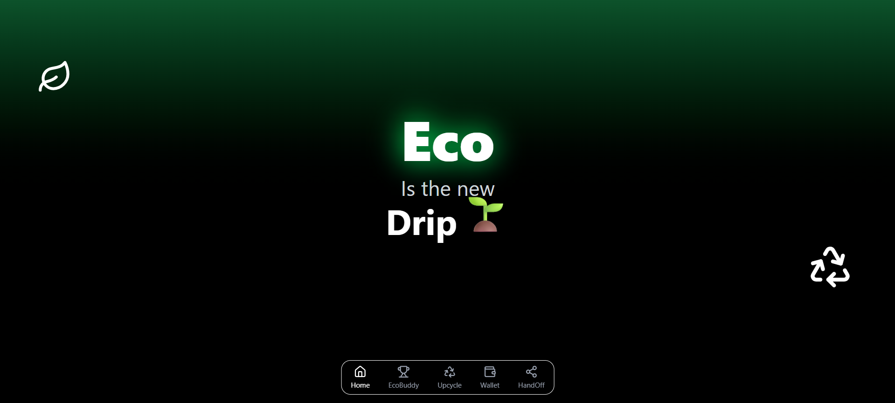
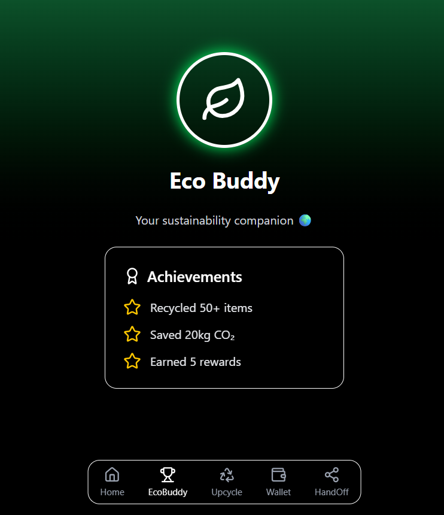
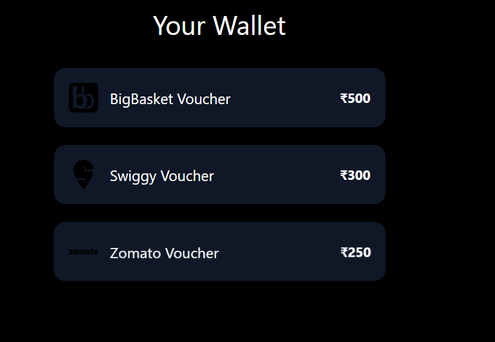

# ♻️ EasyWaste App

Eco is the new drip 🌱  
A modern gamified platform to encourage sustainable living through recycling, upcycling, and eco-friendly rewards.

---

## 🚀 Features
- **Home Page**: Futuristic hero with eco-branding and animations.
- **EcoBuddy**: AI-driven buddy to guide your recycling journey.
- **Upcycle**: Explore creative ideas to reuse waste.
- **Wallet**: Collect vouchers from brands like Amazon, Swiggy, Zomato.
- **HandOff**: Schedule pickup for old electronics (Phone, TV, AC, Washing Machine, etc.).

---

## 🛠️ Tech Stack
- [React + Vite](https://vitejs.dev/) ⚡  
- [Tailwind CSS](https://tailwindcss.com/) 🎨  
- [Lucide Icons](https://lucide.dev/) ✨  
- [Framer Motion](https://www.framer.com/motion/) (optional animations)

---

## 📂 Project Structure
easywaste-app/
├── src/
│ ├── assets/ # logos, icons
│ ├── components/ # shared UI (BottomNav, etc.)
│ ├── pages/ # main screens (Home, Wallet, HandOff, etc.)
│ ├── App.jsx # routes
│ └── index.css # global styles (Tailwind + custom)
├── public/
├── package.json
└── README.md

yaml
Copy code

---

## 🔧 Setup & Installation

1. **Clone the repo**
   ```bash
   git clone https://github.com/YOUR-USERNAME/easywaste-app.git
   cd easywaste-app
Install dependencies

bash
Copy code
npm install
Run the dev server

bash
Copy code
npm run dev
Build for production

bash
Copy code
npm run build
📸 Screenshots




📝 License
MIT License © 2025 EasyWaste Team